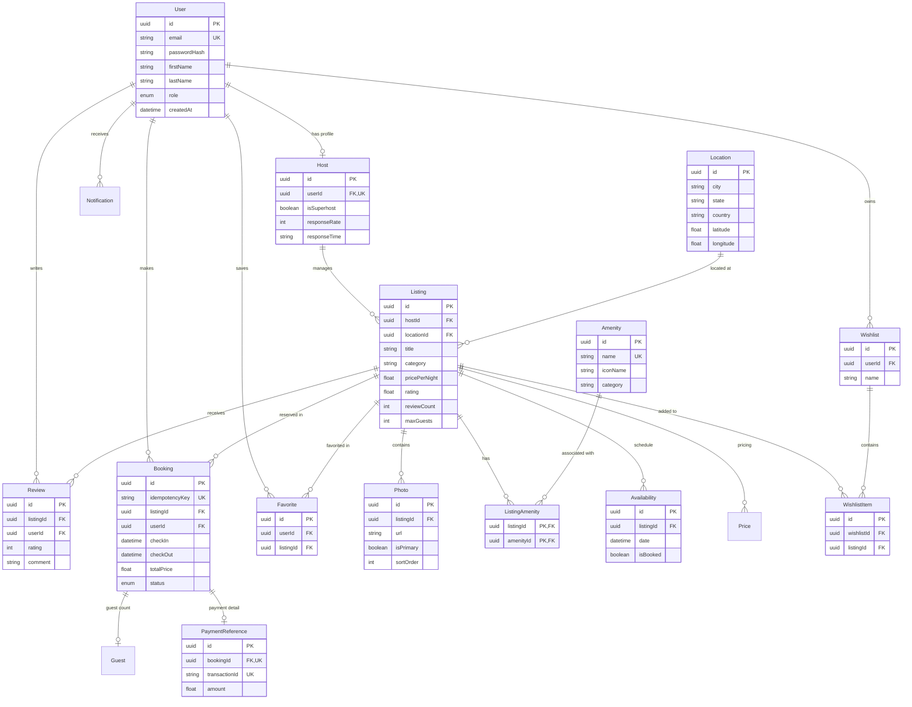

# Entity Relationship Diagram (ERD) — Airbnb Clone Database Architecture

## Relational Schema Diagram (PostgreSQL)

---

## Indexing Strategy Summary

| Entity | Index Type | Columns | Purpose / Query Optimization |
| :--- | :--- | :--- | :--- |
| **Listing** | Composite | `(category, pricePerNight, rating)` | Fast multi-filter search feed queries |
| **Listing** | Single | `locationId` | $O(1)$ relational join to Location |
| **Listing** | Single | `hostId` | Host property portfolio lookups |
| **Location** | Composite | `(city, country)` | Location auto-complete & search bar filtering |
| **Location** | Composite | `(latitude, longitude)` | Spatial radius / bounding box search |
| **Availability**| Composite | `(listingId, date, isBooked)` | Fast booking collision checks & date calendar queries |
| **Booking** | Composite | `(listingId, checkIn, checkOut)` | Transactional availability locking |
| **Photo** | Composite | `(listingId, sortOrder)` | Fast ordered photo gallery retrieval |
| **Review** | Composite | `(listingId, createdAt)` | Paginated review feeds sorted by date |
| **User** | Single | `email` | Instant login verification |
