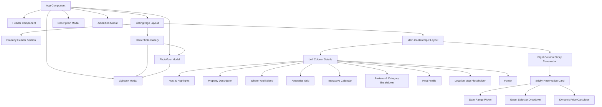
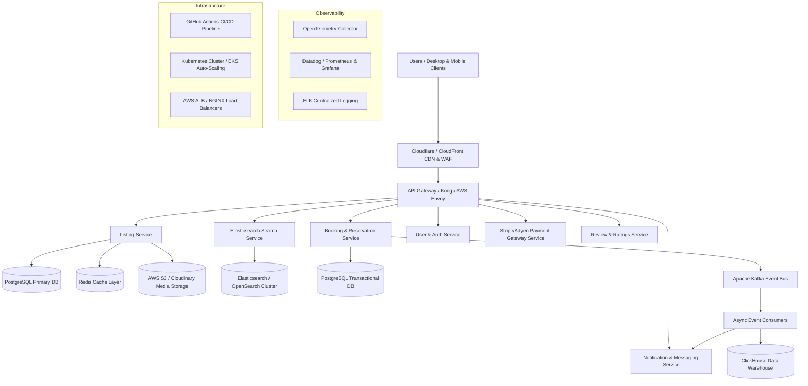

# System Architecture & Technical Specifications

## 1. Overview
This document outlines the architecture for both:
1. **The Airbnb Listing Clone** (Single Page Application built with React, TypeScript, Vite, CSS Modules, and lightweight client state).
2. **The Production-Scale Vacation Rental Marketplace Architecture** (High-scale, microservices-based distributed platform serving millions of active listings).

---

## 2. Frontend Component Architecture (Airbnb Listing Clone)

### Component Hierarchy & Responsibilities

| Component | Responsibility | State Managed |
| :--- | :--- | :--- |
| `App` | Root container, global modal coordinator | `isPhotoTourOpen`, `isLightboxOpen`, `lightboxIndex`, `isDescModalOpen`, `isAmenitiesModalOpen` |
| `Header` | Top navigation, brand logo, search pill bar, user menu | Sticky state, user dropdown menu toggle |
| `PropertyHeader` | Title, rating summary, location, share modal, save toggle | `isSaved` status |
| `HeroGallery` | 5-photo grid layout, hover effects, overlay button | Hover preview index, click handlers to open Lightbox/Photo Tour |
| `ReservationCard` | Sticky booking widget, price calculations, dates/guests | `checkInDate`, `checkOutDate`, `guestCounts` (adults, kids, infants, pets), `totalNights`, `totalPrice` |
| `DatePickerSection` | Interactive calendar for check-in/check-out selection | Active date selection, hover date preview |
| `ReviewsSection` | Rating sub-score breakdown bars, review cards | `reviewFilter`, expanded review toggles |
| `PhotoTour` | Full-screen scrollable image tour grouped by rooms | Scroll position, category filter tabs |
| `Lightbox` | High-res image modal viewer, left/right navigation | Active photo index, keyboard focus lock |

---

## 3. Production-Scale Architecture (Vacation Rental Marketplace)

The architecture diagram below details a multi-region, high-availability cloud infrastructure designed to support hundreds of millions of search queries and booking transactions per day.

### Key Subsystems & Design Choices
1. **Edge & CDN**: Delivers optimized media assets (WebP/AVIF), static single-page apps, and performs geo-routing at low latency.
2. **Search Indexing**: Elasticsearch cluster powered by Kafka CDC (Change Data Capture) from the PostgreSQL primary database ensures listing updates are searchable within milliseconds.
3. **Transactional Isolation**: The Booking Service utilizes distributed locks (Redlock/Redis) and PostgreSQL `SELECT FOR UPDATE` transactions to prevent double-bookings.
4. **Asynchronous Architecture**: Apache Kafka streams booking events to trigger email/SMS notifications, host calendar updates, and data pipeline analytics.
5. **Media Pipeline**: Automated image processing pipeline compresses uploaded photos into multiple WebP resolutions for dynamic responsive loading.
